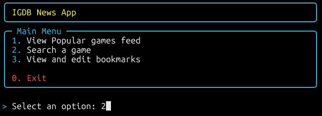
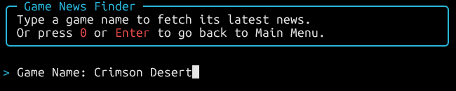
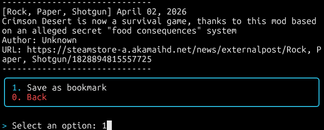
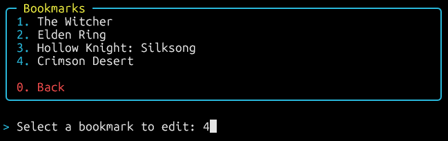
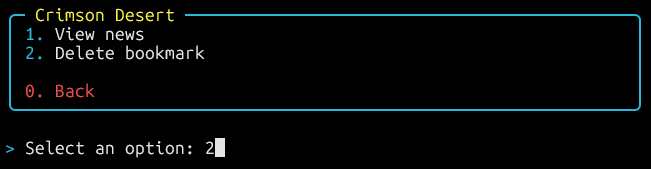

# IGDB News App

This is an app designed to fetch video game news connected to the **IGDB API** through **Twitch OAuth2**.

## How it works:
The app follows three main flows:

**Automatic feed:**
1. **Discover:** Fetches trending games from IGDB based on ratings and hype scores.
2. **Expand:** Resolves each game's franchise or collection to find all related titles.
3. **Fetch:** Retrieves news from the Steam News API for all related Steam IDs.
4. **Display:** Filters and formats news articles for CLI display.

**Manual search:**
1. **Search:** Translates user input into a specific Game ID via IGDB.
2. **Expand:** Pivots from the Game ID to its franchise and related titles.
3. **Fetch:** Retrieves and displays news for that franchise.

**Bookmarks:**
1. **Save:** After searching a game, save it as a bookmark to revisit its news later.
2. **Load:** Select a saved bookmark to instantly load its news feed.
3. **Delete:** Remove bookmarks you no longer need.

## Current features:
- **Secure Environment:** Full `.env` integration and automated Twitch OAuth2 handshake.
- **Modular API Wrapper:** A unified `query_igdb` engine for efficient endpoint communication.
- **Relational Data Mapping:** Automatically identifies a game's franchise and expands search to all related titles.
- **Franchise News Aggregator:** Logic to group game IDs for bulk news fetching.
- **Steam News Integration:** Fetches live news articles for all games in a franchise via the Steam News API.
- **CLI News Display:** Formats and prints news articles with title, source, date, author and URL.
- **Popular Games Feed:** Dynamically fetches trending games from IGDB based on ratings and hype scores.
- **News Filtering:** Filters out non-English sources and articles older than 2 years.
- **Bookmark System:** Save, load, and delete game franchises to quickly access their news feed.
- **Interactive CLI Menu:** Navigate between the popular feed, game search, and bookmarks from a simple numbered menu.
- **Polished CLI Experience:** Interactive menus with styled panels, tables, and real-time status spinners thanks to `Rich` library.

## Requirements:
- **Python 3.12** or higher.
- **Libraries:** 
    - `requests` (API communication)
    - `python-dotenv` (credential management).
    - `rich` (advanced CLI formatting and interactive elements).
- A [Twitch Developers](https://dev.twitch.tv/) account for API credentials.

## Installation and Setup:

1. **Clone the repository:**
   ```
   git clone https://github.com/AVecesPienso/news_app.git
   cd news_app
   ```
2. **Create and activate virtual environment:**
    ```
    python3 -m venv venv
    source venv/bin/activate
    ```
3. **Install dependencies:**
    ```
    pip install -r requirements.txt
    ```
4. **Configure your credentials:**
    - Create a file named `.env` in the root directory
    - Copy the following text and replace it with your data

    ```
    TWITCH_CLIENT_ID=your_client_id_here
    TWITCH_CLIENT_SECRET=your_client_secret_here
    ```

## Project Structure:
```
news_app/
├── main.py
├── requirements.txt
├── .env
├── .gitignore
├── src/
│   ├── bookmarks.py
│   ├── feed.py
│   ├── igdb_client.py
│   ├── menu.py
│   └── news_client.py
└── data/
    └── bookmarks.json  ← generated automatically on first run
```

## Usage:
Run the main script to launch the interactive CLI menu:
```
python main.py
```
## Example output:
##### Main menu

##### Search submenu

##### Save bookmark menu

##### Feedback status


##### Bookmark menu




## Known limitations:
- News are fetched from Steam and may include related titles in the same franchise.
- Some games may not appear in the feed if their Steam ID is not registered in IGDB (e.g. Hollow Knight, Marvel Rivals) and will not appear in search results.
- News are only available in languages supported by Steam News API — non-English sources are partially filtered.

## Roadmap:
- ✅ Convert Game IDs to Steam AppIDs via `external_games`.
- ✅ Fetch live patch notes and announcements using the Steam News API.
- ✅ Format news feed for readable CLI display (feed.py).
- ✅ Build interactive CLI menu with `rich` integration.
- ✅ Implement bookmarks system with JSON storage.